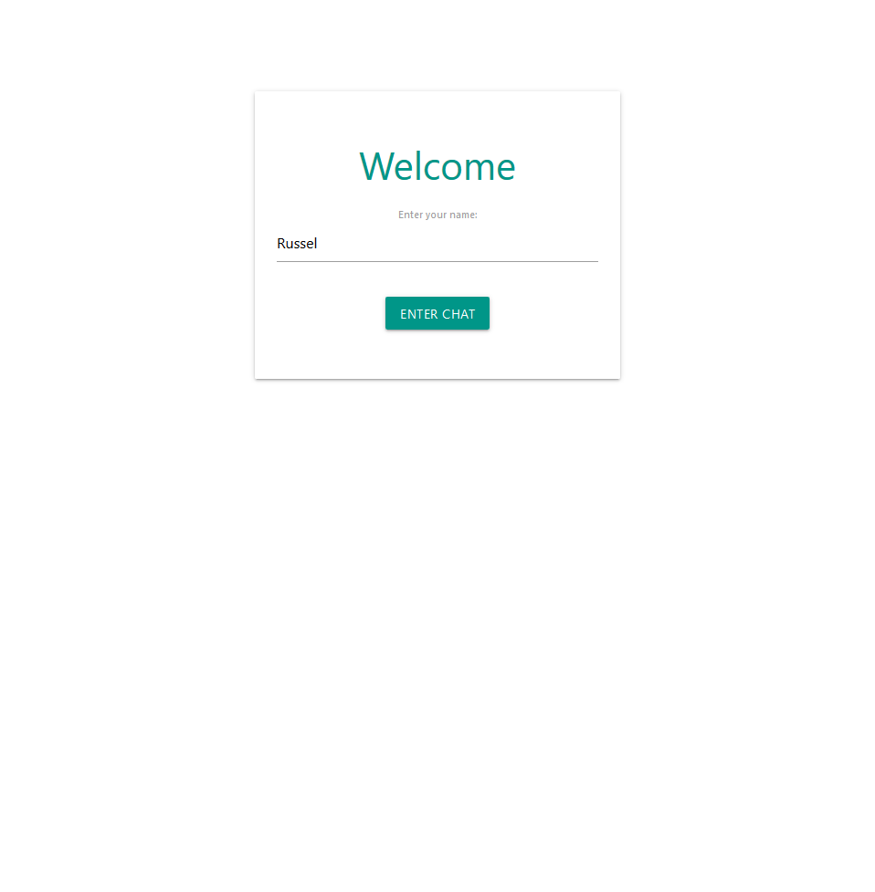
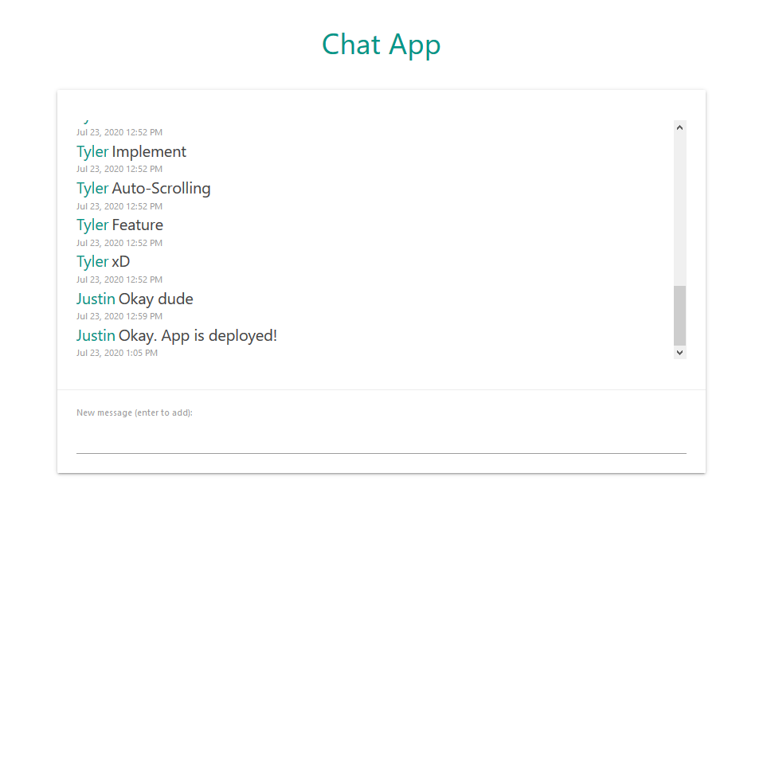
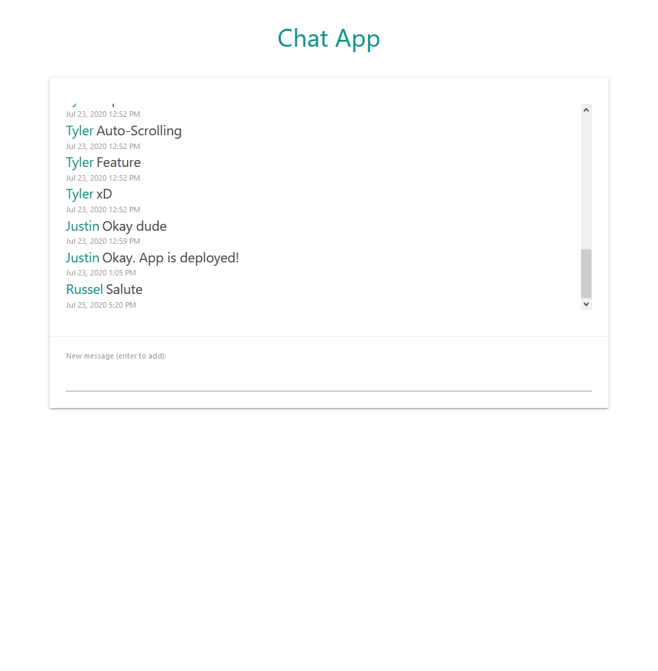

# Real-time Chat App

Hi, this is a real-time chat room I developed with Vue.js and Firebase. The user can just enter their name to enter the chat room and start sending messages right away (No registration need). The application is implemented with auto-scrolling and showing the latest messages at the bottom of the chat component.

You can try it out [here](https://chat-app-8de2c.web.app/).

## Screenshots





## Dependencies 

- Node.js 
- Firebase (Hosting, Firestore)
- Vue.js
- [Materialize CSS](https://materializecss.com/)
- [Momentjs](https://momentjs.com/)

---

## Build Setup for Vue.js

``` bash
# install dependencies
npm install

# serve with hot reload at localhost:8080
npm run dev

# build for production with minification
npm run build

# build for production and view the bundle analyzer report
npm run build --report
```

For a detailed explanation on how things work, check out the [guide](http://vuejs-templates.github.io/webpack/) and [docs for vue-loader](http://vuejs.github.io/vue-loader).
